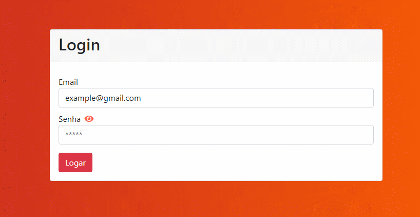
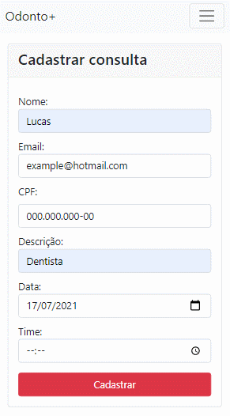

# 🥼 OdontoPlus 🥼
OdontoPlus é um sistema Gestão de consultas para consultório Odontológico.

## ↔ Páginas 100% responsivas ↔

As páginas da aplicação são 100% responsivas e se adaptam a qualquer device.

## 📍 Características 📍
- O sistema permite criar, visualizar e finalizar consultas de uma maneira rápida

- O sistema se encarrega de enviar um e-mail automaticamente para o usuário sempre que chegar perto do horário da consulta

- Sistema de login e logout

- Calendário integrado

- Lista com todas as consultas

## 💻 Tecnologias usadas 💻

* HTML
 * CSS
 * JavaScript
 * Node.js
 * FullCalendar
 * MongoDB
 * Express
 * EJS